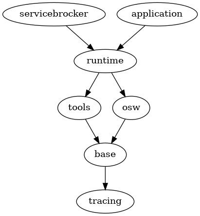

[Go to contents](../../README.md#table-of_contents)

## Components overview

CARPC framework comprises a series of dynamic libraries and executable files, each providing specific functionality. This design is aimed at eliminating the need to link and load libraries whose functionality isn't utilized within the application. Below is the set of these libraries and executables along with descriptions of their purposes:

#### Libraries:

1. **libtracing.so**
    - **Description:** This library provides a collection of macros for outputting informational and debugging messages of various logging levels. Additionally, it facilitates the selection of logging strategies, enabling message output to the console, DLT daemon, or logcat, depending on the chosen strategy.

2. **libbase.so**
    - **Description:** libbase.so contains a set of fundamental types used within the framework, along with general-purpose auxiliary functions.

3. **libosw.so**
    - **Description:** This library encompasses a set of wrapper functions over operating system system calls or standard library functions. These wrappers enhance the convenience of invoking system functions and provide additional output of information, thus reducing the need for developers to write supplementary code. Moreover, libosw.so incorporates higher-level abstractions to facilitate interactions with system-level components utilized within the framework.

4. **libtools.so**
    - **Description:** libtools.so includes auxiliary functionalities and utilities for use within applications. These utilities encompass command-line parameter handling, configuration file parsing, performance measurement of executed functionalities, and more.

5. **libruntime.so**
 - **Description:** Serving as the central library of the CARPC framework, libruntime.so provides functionality as described in the [Main purpose](../about/main_purpose.md) section. This functionality includes asynchronous invocation, event system, component architecture, RPC, interface descriptions, and more.

#### Executables:

6. **servicebroker**
    - **Description:** This executable file serves as the central node for registering applications participating in Inter-Process Communication (IPC). It is launched first and acts as an address book for other applications. Each application that provides or uses interfaces for communication between different applications registers with the servicebroker, following a specific protocol. It then receives information about other applications providing the interfaces it is interested in.

### Dependency Diagram

Below is the dependency diagram illustrating the relationships between various libraries, executable files, and `application` developed using the CARPC framework.

