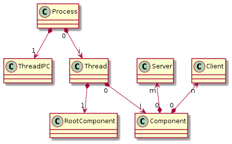

[Go to previous menu](./entities_description.md#entities-description)

# ***Application structure entities***

**CARPC** framework contains next main ***Applicationentities ***:
- [***Application structure entities***](#application-structure-entities)
  - [***Application Process***](#application-process)
  - [***Application Thread***](#application-thread)
  - [***IPC Application Thread***](#ipc-application-thread)
  - [***Application Component***](#application-component)

Common structure of **CARPC Application** has next representation:

----

## ***Application Process***

**Application Process** is a singletone object what is created in generated main function (based on *.adl file), contains other lower level by hierarchy objects (such as **IPC Application Thread**, **Application Threads**, **Service Registry** and **Application configuration data**) and is responcible for creation, initialization, deinitialization and deletion of this objects during booting and shutting down application.

**Application Process** also responsible for processing command line arguments, environment variables and application configuration file. Based on all these stuff **Application Process** build common configuration what will be used for application.

**Application Process** is not implemented by application developer. It just could be configured and used as a part of framework runtime. All code related to creating and strating **Application Process** object and general **main** function are generated from **ADL** (Application Description Language) file. This file is used for describing **Application Threads**, **Application Components**, **Watchdog timeouts** and other stuff for current application.

----

## ***Application Thread***

**Application Thread** is the **CARPC** object what encapsulates creationd of **OS thread** and manages its lifetime. In context of this threads are created predefined **Application Components**. In this case **CARPC Application Thread** is a container of these **Application Components** and also manages their lifetimes.

Each **Application Thread** also contains event queue and consumers map what are created and registered in the context of current thread. Each **Event** what delivered to mentioned queue will be processed in current **OS thread contex**, corresponding consumer will be found and consumer's event processor function will be called with corresponding **Event** as a parameter. This circumstance guarantees that **Event** will be delivered to its consumer and process by last one **always** in context where this consumer has been created.

Similar to **Application Process** **Application Thread** is not implemented by application developer. Last one could just configure amount of **Application Threads** in application configure each of them.

----

## ***IPC Application Thread***

This is **CARPC** object similar to **Application Thread** but has another one perpose. It is responsible for IPC communication between different processes what are implemented using **CARPC** framework and according **CARPC** communication protocol, regestering clients and servers located in different applications and establishing connection between them.

**IPC Application Thread** could not be configured by developer as usual **Application Thread** and as a result does not contain any **Application Component**.

----

## ***Application Component***

**Application Component** is the **CARPC** entity that is an entry point and sanbox for implemention application code by developer.

Each application could contain any quantity of **Application Components**.

In contrast with **Application Process** and **Application Thread** each **Application Component** is designed and implemented by application developer. But at the same time all implemented **Components** must be a part of configuration for **Application Process** and described in **ADL** file.

During startup all **Application Components** will be created automatically and in predefined context (**Application Thread**) by framework runtime according to user's defined configuration.

All **Application Components** are equal in the system excapt one - **Application Root Component**.
Each **CARPC** application must has one **Application Root Component**. In contradistinction to simple **Components** **Root Component** has few differences:
   - Virtual function **process_boot** what must be implemented in this component. This function acts as an entry point for developers code execution when **CARPC runtime** configured and initialized.
   - Built-in **shutdown** function what could be called from **Root Component** to initialize shutdown system, stop **CARPC runtime** and exit process.
In other respects **Root Component** is the same as other **Components**.
