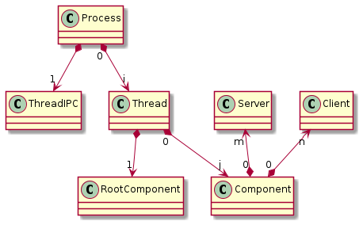

[Go to previous menu](./entities_description.md#entities-description)

# Application Structure Entities

The ***CARPC*** framework comprises the following main application structure entities:

- [Application Structure Entities](#application-structure-entities)
  - [Application Process](#application-process)
  - [Application Thread](#application-thread)
  - [IPC Application Thread](#ipc-application-thread)
  - [Application Component](#application-component)

The general structure of a `CARPC Application` is represented as follows:

---

## Application Process

The `Application Process` is a singleton object created in the generated main function (based on the *.adl file). It encompasses other hierarchical objects such as the [IPC Application Thread](#ipc-application-thread), [Application Thread](#application-thread), `Service Registry`, and `Application configuration data`. It is responsible for the creation, initialization, deinitialization, and deletion of these objects during the application boot and shutdown phases.

The `Application Process` also handles command line arguments, environment variables, and the application configuration file. Using this information, the `Application Process` builds a comprehensive configuration for the application.

The `Application Process` is not directly implemented by the application developer; it can only be configured and utilized as part of the framework runtime. All code related to the creation and startup of the `Application Process` and the main function is generated from the `ADL` (Application Description Language) file, which describes [Application Threads](#application-thread), [Application Components](#application-component), `Watchdog timeouts`, and other elements of the application.

---

## Application Thread

The `Application Thread` is a ***CARPC*** object that encapsulates the creation of an **OS thread** and manages its lifecycle. Predefined [Application Components](#application-component) are created within these threads, making the [Application Thread](#application-thread) a container for these [Application Components](#application-component) and their lifecycle management.

Each `Application Thread` contains an event queue and a consumer map registered within the thread's context. Events delivered to this queue are processed in the current **OS thread context**. The appropriate consumer is found, and the consumer's event processor function is called with the event as a parameter. This ensures that the event is always processed in the context where the consumer was created.

Like the [Application Process](#application-process), the `Application Thread` is not implemented by the application developer but can be configured in terms of quantity and properties.

---

## IPC Application Thread

The `IPC Application Thread` is similar to an [Application Thread](#application-thread) but serves a specialized purpose. It manages IPC communication between different processes implemented using the ***CARPC*** framework, according to the ***CARPC*** communication protocol. It registers clients and servers across different applications and establishes connections between them.

The `IPC Application Thread` cannot be configured by the developer like a regular [Application Thread](#application-thread) and does not contain any [Application Component](#application-component).

---

## Application Component

The `Application Component` is a ****CARPC*** entity that serves as the primary point of entry and sandbox for the developer's application code.

An application can have any number of `Application Components`.

Unlike the [Application Thread](#application-thread) and [Application Process](#application-process), each `Application Component` is designed and implemented by the application developer. However, all implemented **Components** must be part of the [Application Process](#application-process) configuration and described in the **ADL** file.

During startup, all `Application Components` are automatically created within a predefined context ([Application Thread](#application-thread)) by the framework runtime according to the user-defined configuration.

All `Application Components` are equal in the system except for one - the `Application Root Component`. Each ***CARPC*** application must have one `Application Root Component`, which differs from other components in a few ways:
- It has a virtual function `process_boot`, which must be implemented. This function acts as the entry point for the developer's code execution once the ***CARPC runtime*** is configured and initialized.
- It includes a built-in `shutdown` function that can be called to initiate system shutdown, stop the ***CARPC runtime***, and exit the process.

In all other respects, the `Root Component` is the same as other `Components`.
