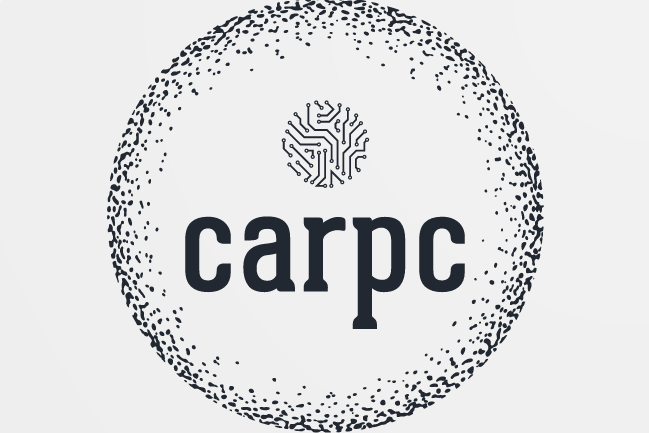

# ***CARPC***

----

## ***Table of contents***

- [What is CARPC](./.md/what_is_carpc.md#what-is-carpc)
- [How to build](./.md/how_to_build.md#how-to-build)
- [Runtime entities description](./.md/entities_description.md#entities-description)
- [Tracing](./.md/tracing.md#tracing)
- [Development](./.md/development.md#development)
- [Configuration parameters](./.md/configuration_parameters.md#configuration-parameters)
- [Abbreviations](./.md/abbreviations.md#abbreviations)

----

## [Repo size](./.md/repo_size/repo_size.md)

----
